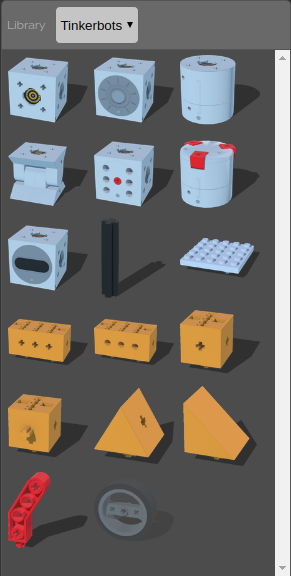

# Robot Designer

The Robot Designer tool lets users build custom robots in an easy and quick way. With the automatic snap mechanism you simply have to drag parts at the desired position and the tool will position it for you.


## Demo

https://omichel.github.io/robot-designer/

## Run locally

1. Create an HTTP server on the parent directory:

```
cd $REPO_CLONE
cd ..
python -m SimpleHTTPServer
```

2. Open "http://localhost:8000/robot-designer/"

## Toolbar


* Export: export the modeled robot to JSON, Webots, and NRP compatible (coming soon..) format.
* Undo: erase the last change done to the robot.
* Redo: reverse the undo change.
* Selection tool: disable the translation and rotation tools.
* Translation tool: enable displaying the translation gizmo for the selected part. Note that translation constraints could be set for the slot connection of the selected part.
* Rotation tool: enable displaying the rotation gizmo for the selected part. Note that rotation constraints can be set for the slot connection of the selected part.
* Delete: delete the selected robot part.
* Fullscreen: enter/exit full screen mode.

## Library



The library contains all the available robot parts.
The parts are grouped by robotics kit and the kit can be chosen using the combo box.
Only parts that can be added to the current robot model are enabled.
Parts that need a slot connection that it is currently not available with the robot model are shown in the library but they are disabled.


## Part Viewer


The part viewer shows the properties of the selected part and lets the user customize it
In particular it includes the name of the part and all the parameters, if any, that can be modified.

## How to build a robot

### Adding Parts
To build your custom robot you simply have to click on a part in the library, drag it on the 3D scene and drop it at the desired position.


When you drag the part in the 3D scene you will see a ghost image of the part itself and all the available slot positions where you can place it will be displayed in green.


If you then drag the part on a slot, the selected slot will be displayed in blue and the ghost image of the part will be automatically displayed in the final position using an automatic snap mechanism.


### Translating and Rotating Parts

If the automatic snap mechanism doesn't put the parts at the desired position, it is possible to translate or rotate it enabling the translation or rotation tool.
First, you have to select the translation/rotation tool from the toolbar, then you select the part you want to move.
At this point the translation/rotation gizmo will be displayed for the selected part and you can move it.


Note that some slot types have special constraints on rotation and translation.
For this reason it can happen that the rotation and translation is limited to some axes or that it is not available at all.

### Deleting Parts

You can delete parts by selecting them and clicking on the *Delete* button in the toolbar.
Note that all the children parts connected to the selected part will also be deleted.

## Interaction with the 3D Scene

### Object Selection

If you move your mouse pointer over a robot part, a white outline of the part is displayed.
It is possible to select an object or a robot in the 3D scene by clicking on it using the left mouse button.
Once selected, a blue outline is displayed.

### Navigation in 3D

#### Rotate Viewpoint

To rotate the camera around the x and y axis, you have to set the mouse pointer in the 3D scene, press the left mouse button, and drag the mouse.
The rotation is centered around the scene center.

#### Translate Viewpoint

To translate the camera in the x and y directions, you have to set the mouse pointer in the 3D scene, press the right mouse button, and drag the mouse.

#### Zoom

To zoom in or out the 3D scene, set the mouse pointer in the 3D scene and use the wheel or press the middle button of the mouse and drag the mouse.

## Export

The created robot model can be exported in three different formats.


#### Export to JSON

This functionality exports the model in a generic JSON format describing the structure of the robot and the position and customizable parameters of the parts.

#### Export to Webots

This functionality generates a Webots WBT file containing the created robot that can directly imported in Webots.

#### Export to NRP (coming soon..)

This functionality generates a robot model compatible wit the Neurorobotics Platform (https://neurorobotics.net/).
